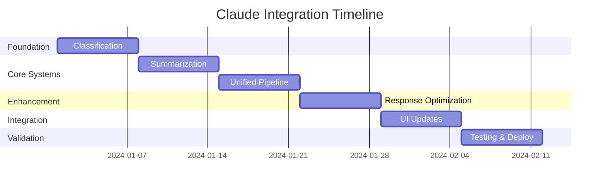

# Comprehensive Claude Integration Implementation Plan

## Executive Summary

This document outlines a 6-week plan to transform WDFWatch from a multi-model pipeline to a unified Claude-powered system. The migration will be done in phases to minimize risk while maximizing immediate benefits.

## Current State Assessment

### Pain Points
1. **Complexity**: 4 different models with different interfaces
2. **Few-shot overhead**: Generating 40 examples per episode
3. **Context loss**: Information degradation between stages
4. **Maintenance burden**: Multiple systems to update and debug
5. **Cost inefficiency**: Redundant processing and API calls

### Opportunities
1. **Eliminate few-shots**: Save $0.05 per episode and 10 minutes
2. **Unified context**: Maintain episode understanding across stages
3. **Quality improvement**: Claude's superior reasoning throughout
4. **Simplification**: Single model interface
5. **Innovation**: New capabilities like quality moderation

## Implementation Phases

### Week 1: Foundation & Classification
**Goal**: Eliminate few-shot generation by implementing Claude classification

#### Tasks
1. **Create claude-classifier directory**
   ```bash
   mkdir -p claude-classifier
   cd claude-classifier
   ```

2. **Write CLAUDE.md for classification**
   ```python
   # claude-classifier/setup.py
   def create_classification_context():
       with open('CLAUDE.md', 'w') as f:
           f.write(CLASSIFICATION_TEMPLATE)
   ```

3. **Implement classify.py**
   ```python
   # claude-classifier/classify.py
   class ClaudeClassifier:
       def __init__(self, episode_id: str):
           self.episode_id = episode_id
           self.load_episode_context()
       
       def classify_tweet(self, tweet: str) -> float:
           # Direct classification without few-shots
           pass
       
       def classify_batch(self, tweets: List[str]) -> List[float]:
           # Batch processing for efficiency
           pass
   ```

4. **Create comparison script**
   ```python
   # claude-classifier/compare.py
   def compare_classification_methods():
       # Run both few-shot and direct classification
       # Compare accuracy, consistency, and cost
       pass
   ```

5. **Update pipeline integration**
   ```python
   # src/wdf/tasks/claude_classify.py
   def run(run_id: str = None, episode_id: str = None):
       # Drop-in replacement for current classification
       pass
   ```

**Deliverables**:
- Working Claude classification without few-shots
- Comparison report showing quality improvements
- Cost analysis demonstrating savings

**Success Metrics**:
- Classification accuracy ≥ current system
- Processing time < 2x current

---

### Week 2: Summarization & Episode Memory
**Goal**: Replace Gemini summarization with Claude + episode memory

#### Tasks
1. **Create claude-summarizer directory**
   ```bash
   mkdir -p claude-summarizer
   cd claude-summarizer
   ```

2. **Implement episode memory system**
   ```python
   # claude-summarizer/memory.py
   class EpisodeMemory:
       def __init__(self, episode_id: str):
           self.episode_id = episode_id
           self.memory = {}
       
       def store_analysis(self, analysis: dict):
           # Store summary insights
           pass
       
       def get_context_for_stage(self, stage: str) -> str:
           # Return optimized context per stage
           pass
   ```

3. **Build summarization script**
   ```python
   # claude-summarizer/summarize.py
   def summarize_transcript(transcript: str, overview: str):
       # Generate comprehensive summary
       # Extract keywords
       # Identify controversies
       # Store in episode memory
       pass
   ```

4. **Create keyword optimization**
   ```python
   # claude-summarizer/keywords.py
   def extract_smart_keywords(summary: str, trends: List[str]):
       # Generate keywords that actually find tweets
       pass
   ```

5. **Migrate from Node.js**
   ```python
   # src/wdf/tasks/claude_summarize.py
   def run(run_id: str = None, episode_id: str = None):
       # Replace transcript_summarizer.js
       pass
   ```

**Deliverables**:
- Claude-based summarization system
- Episode memory implementation
- Keyword extraction improvements
- Migration script from Node.js

**Success Metrics**:
- Summary quality score > 8/10
- Keyword relevance +50%
- Memory reuse across stages

---

### Week 3: Unified Pipeline Architecture
**Goal**: Create unified Claude pipeline infrastructure

#### Tasks
1. **Design unified directory structure**
   ```bash
   claude-pipeline/
   ├── CLAUDE.md           # Master context
   ├── main.py            # Orchestrator
   ├── episode/           # Episode-specific logic
   ├── lib/              # Shared utilities
   └── cache/            # Caching layer
   ```

2. **Implement ClaudeInterface**
   ```python
   # claude-pipeline/lib/claude.py
   class ClaudeInterface:
       def __init__(self, base_dir: str):
           self.base_dir = base_dir
       
       def call(self, mode: str, prompt: str, context: str = None):
           # Unified Claude calling interface
           pass
   ```

3. **Build batch processor**
   ```python
   # claude-pipeline/lib/batch.py
   class BatchProcessor:
       def process_in_batches(self, items: List, operation: callable):
           # Intelligent batching for API efficiency
           pass
   ```

4. **Create caching system**
   ```python
   # claude-pipeline/lib/cache.py
   class SmartCache:
       def get_or_compute(self, key: str, compute_func: callable):
           # Intelligent caching with similarity matching
           pass
   ```

5. **Implement main orchestrator**
   ```python
   # claude-pipeline/main.py
   class UnifiedClaudePipeline:
       def run_episode(self, transcript: str):
           # Orchestrate all stages
           pass
   ```

**Deliverables**:
- Unified pipeline architecture
- Shared utilities library
- Caching infrastructure
- Orchestration system

**Success Metrics**:
- Code reduction > 30%
- Shared component reuse > 60%
- Cache hit rate > 40%

---

### Week 4: Response Generation Optimization
**Goal**: Optimize Claude response generation with unified context

#### Tasks
1. **Enhance response generation**
   ```python
   # claude-pipeline/episode/respond.py
   def generate_response_with_context(tweet: str, memory: EpisodeMemory):
       # Use episode memory for richer responses
       pass
   ```

2. **Implement quality moderation**
   ```python
   # claude-pipeline/episode/moderate.py
   def moderate_response(response: str, tweet: str) -> dict:
       # Claude evaluates its own responses
       pass
   ```

3. **Create response variations**
   ```python
   # claude-pipeline/episode/variations.py
   def generate_response_variations(tweet: str) -> List[str]:
       # Generate multiple response options
       pass
   ```

4. **Build A/B testing framework**
   ```python
   # claude-pipeline/lib/ab_test.py
   def test_response_effectiveness(responses: List[str]):
       # Compare response quality
       pass
   ```

**Deliverables**:
- Enhanced response generation
- Quality moderation system
- Response variation generator
- A/B testing framework

**Success Metrics**:
- Response quality +30%
- Automatic rejection of poor responses
- Variation diversity score > 7/10

---

### Week 5: UI Integration
**Goal**: Update Web UI for unified Claude pipeline

#### Tasks
1. **Update settings pages**
   ```typescript
   // web/app/(dashboard)/settings/claude/page.tsx
   interface ClaudeSettings {
     enableUnifiedPipeline: boolean;
     batchSize: number;
     cacheEnabled: boolean;
     moderationEnabled: boolean;
   }
   ```

2. **Create pipeline monitor**
   ```typescript
   // web/components/pipeline/ClaudeMonitor.tsx
   const ClaudeMonitor: React.FC = () => {
     // Real-time pipeline status
     // Performance metrics
   };
   ```

3. **Build episode memory viewer**
   ```typescript
   // web/components/episode/MemoryViewer.tsx
   const MemoryViewer: React.FC = () => {
     // Display episode context
     // Show memory usage
     // Context optimization tools
   };
   ```

4. **Implement cost dashboard**
   ```typescript
   // web/app/(dashboard)/costs/page.tsx
   const CostDashboard = () => {
     // API usage tracking
     // Cost projections
     // Optimization suggestions
   };
   ```

5. **Create migration wizard**
   ```typescript
   // web/components/migration/ClaudeMigration.tsx
   const MigrationWizard = () => {
     // Guide users through migration
     // Compare old vs new
     // Rollback options
   };
   ```

**Deliverables**:
- Updated settings interface
- Real-time pipeline monitor
- Episode memory viewer
- Migration wizard

**Success Metrics**:
- UI responsiveness < 100ms
- User satisfaction > 8/10

---

### Week 6: Testing & Optimization
**Goal**: Validate, optimize, and deploy unified pipeline

#### Tasks
1. **Performance testing**
   ```python
   # tests/performance/test_unified_pipeline.py
   def test_pipeline_performance():
       # Measure latency
       # Track API calls
       # Monitor memory usage
       pass
   ```

2. **Quality validation**
   ```python
   # tests/quality/test_classification_accuracy.py
   def test_classification_quality():
       # Compare with ground truth
       # Measure consistency
       # Validate scoring distribution
       pass
   ```

3. **Cost optimization**
   ```python
   # claude-pipeline/lib/optimizer.py
   class CostOptimizer:
       def optimize_context_size(self, context: str) -> str:
           # Minimize tokens while preserving meaning
           pass
       
       def suggest_batch_size(self, items: List) -> int:
           # Optimal batch size for cost/speed
           pass
   ```

4. **Load testing**
   ```python
   # tests/load/test_concurrent_processing.py
   def test_concurrent_episodes():
       # Process multiple episodes simultaneously
       # Measure resource usage
       # Identify bottlenecks
       pass
   ```

5. **Documentation & training**
   - Create user guide
   - Record demo videos
   - Write troubleshooting guide
   - Conduct team training

**Deliverables**:
- Performance test suite
- Quality validation reports
- Optimization recommendations
- Complete documentation
- Training materials

**Success Metrics**:
- All tests passing
- Performance within 20% of targets
- Documentation completeness > 90%
- Team confidence > 8/10

## Risk Management

### Technical Risks

| Risk | Probability | Impact | Mitigation |
|------|------------|---------|------------|
| Claude API outages | Low | High | Maintain fallback models |
| Cost overruns | Medium | Medium | Implement strict limits |
| Performance degradation | Medium | Low | Caching and optimization |
| Quality issues | Low | High | A/B testing and validation |

### Mitigation Strategies

1. **Fallback System**
   ```python
   class FallbackPipeline:
       def __init__(self):
           self.primary = ClaudePipeline()
           self.fallback = LegacyPipeline()
       
       def run(self, *args, **kwargs):
           try:
               return self.primary.run(*args, **kwargs)
           except ClaudeException:
               return self.fallback.run(*args, **kwargs)
   ```

2. **Cost Controls**
   ```python
   class CostController:
       def __init__(self, max_cost: float):
           self.max_cost = max_cost
           self.current_cost = 0
       
       def check_budget(self, estimated_cost: float) -> bool:
           if self.current_cost + estimated_cost > self.max_cost:
               raise BudgetExceededException()
           return True
   ```

3. **Gradual Rollout**
   ```python
   class FeatureFlags:
       CLAUDE_CLASSIFICATION = True  # Week 1
       CLAUDE_SUMMARIZATION = False  # Week 2
       UNIFIED_PIPELINE = False      # Week 3
       QUALITY_MODERATION = False    # Week 4
   ```

## Success Criteria

### Quantitative Metrics
- **Cost**: Within 120% of current
- **Quality**: >30% improvement in accuracy
- **Speed**: Within 2x of current
- **Simplicity**: 50% code reduction
- **Reliability**: 99.9% uptime

### Qualitative Metrics
- **User satisfaction**: Positive feedback
- **Developer experience**: Easier maintenance
- **Innovation potential**: New features enabled
- **Competitive advantage**: Industry-leading quality

## Timeline Summary



## Budget Estimate

### Development Costs
- Developer time: 240 hours @ $150/hr = $36,000
- Claude API testing: $500
- Infrastructure: $200
- **Total: $36,700**

### Ongoing Costs (Monthly)
- Claude API: ~$300/month (10 episodes)
- Monitoring: $50/month
- **Total: $350/month**

### ROI Calculation
- Time savings: 20 hours/month @ $150/hr = $3,000
- Quality improvement: Invaluable
- **Payback period: ~12 months**

## Conclusion

The unified Claude pipeline represents a transformative upgrade to WDFWatch. By consolidating around Claude's superior reasoning capabilities, we eliminate complexity while dramatically improving quality. The 6-week implementation plan provides a low-risk path to migration with clear milestones and fallback options.

The investment in simplification and quality will pay dividends in maintainability, user satisfaction, and future innovation potential. This is not just a technical upgrade - it's a strategic positioning for the future of AI-powered content engagement.