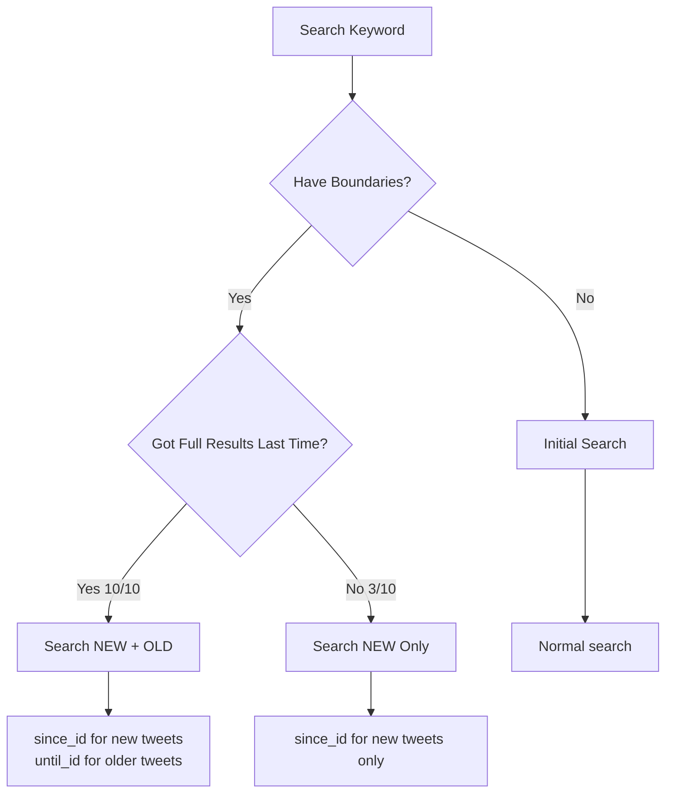

# Search Boundary Checkpoint System

## Overview

The Search Boundary Checkpoint System prevents re-fetching already-seen tweets by tracking the boundaries of each keyword search. This implementation follows the **"Checkpoint your runs"** strategy from the Twitter/X API conservation documentation.

## How It Works

### Core Concept
For each keyword, we track:
- **newest_id**: The most recent tweet we've seen (first in results)
- **oldest_id**: The oldest tweet we've seen (last in results)  
- **results_count**: How many tweets we found
- **last_search**: When we last searched

### Search Strategy



### The Key Insight

- **Got < max_results** (e.g., 3/10): We exhausted the search window. There are NO older tweets to find. Only search forward.
- **Got = max_results** (e.g., 10/10): We hit our limit. There are likely MORE older tweets we missed. Search both directions.

## Implementation

### Files
- `src/wdf/search_boundaries.py` - Boundary management system
- `src/wdf/twitter_api_v2.py` - Integration with search logic
- `artefacts/search_boundaries.json` - Persistent storage

### Example Flow

#### Day 1: Initial Search
```python
# Search "federalism" - finds 10 tweets (IDs: 1000-1009)
boundaries['federalism'] = {
    'newest_id': '1000',
    'oldest_id': '1009', 
    'results_count': 10,
    'search_window_days': 7
}
```

#### Day 2: Follow-up Search
```python
# Since we got 10/10, search both directions:
params = {
    'since_id': '1000',  # Get tweets newer than our newest
    'until_id': '1009',  # Get tweets older than our oldest
    'search_type': 'new_and_old'
}
```

## Edge Cases Handled

1. **Partial Results**: If only 3 tweets found, don't search older (window exhausted)
2. **Window Expansion**: If search window changes 7→30 days, reset boundaries
3. **No Results**: Don't store boundaries for keywords with no tweets
4. **Two-Direction Search**: Makes two API calls when searching both new and old

## API Quota Savings

### Without Boundaries (Naive Approach)
- Day 1: Search "federalism" → 10 tweets
- Day 2: Search "federalism" → Same 10 tweets + 2 new = 12 reads
- **Wasted**: 10 duplicate reads

### With Boundaries (Optimized)
- Day 1: Search "federalism" → 10 tweets
- Day 2: Search with since_id → Only 2 new tweets = 2 reads
- **Saved**: 10 reads (10% of daily quota!)

### Real-World Impact
With 20 keywords searched daily:
- **Without boundaries**: ~200 duplicate reads/day = 6,000/month
- **With boundaries**: 0 duplicate reads
- **Monthly savings**: 60% of quota preserved!

## Configuration

### Enable/Disable
```python
# Use boundaries (default)
twitter_api = TwitterAPIv2()  # Boundaries enabled

# Reset boundaries for a keyword
twitter_api.boundary_manager.reset_keyword('federalism')

# View boundary info
info = twitter_api.boundary_manager.get_boundary_info('federalism')
```

### Monitoring
```python
# Get savings estimate
savings = twitter_api.boundary_manager.estimate_savings()
print(f"Duplicates avoided: {savings['estimated_duplicates_avoided']}")
print(f"Quota saved: {savings['percentage_of_monthly_quota_saved']}%")
```

## Best Practices

1. **Don't Reset Unnecessarily**: Boundaries are valuable - only reset if keywords change
2. **Monitor Savings**: Check the savings metrics to see impact
3. **Clean Old Boundaries**: Remove boundaries >30 days old to save storage
4. **Handle Window Changes**: System auto-resets if search window expands significantly

## Technical Details

### Storage Format
```json
{
  "federalism": {
    "keyword": "federalism",
    "newest_id": "1234567890",
    "oldest_id": "1234567899",
    "last_search": "2025-01-20T10:30:00",
    "results_count": 10,
    "search_window_days": 7
  }
}
```

### API Parameters Used
- `since_id`: Returns results with IDs greater than (more recent than) the specified ID
- `until_id`: Returns results with IDs less than (older than) the specified ID
- These are more efficient than time-based parameters and guarantee no duplicates

## Testing

Run the boundary system tests:
```bash
python tests/test_search_boundaries.py
```

This verifies:
- Correct logic for when to search new/old/both
- Persistence and recovery
- Savings calculations
- Edge case handling