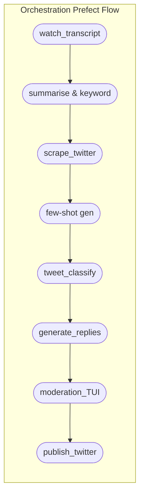

# WDF Podcast Social‑Engagement Pipeline – **Implementation Guide**

> **Revision 2025‑06‑28** — incorporates architecture & DX improvements proposed after the initial PoC.

---

## 1 · Purpose & Scope

This document is the **single source of truth** for building, testing, and operating the WDF social‑engagement pipeline.  It replaces the earlier draft with a production‑grade design that emphasises configurability, observability, and developer experience.

---

## 2 · High‑Level Architecture



* **Prefect 2** orchestrates all tasks, yielding retries, caching and a UI.
* Each task is runnable **stand‑alone** (`python -m wdf.tasks.<name>`).

---

## 3 · Repository Layout

```
.
├── src/wdf/                # Python package root
│   ├── __init__.py
│   ├── settings.py         # pydantic‑settings config loader
│   ├── flow.py             # Prefect deployment
│   ├── tasks/              # One file per pipeline task
│   │   ├── watch.py        # watches for new transcripts
│   │   ├── summarise.py    # Gemini → summary + keywords
│   │   ├── scrape.py       # Twitter client (interface)
│   │   ├── fewshot.py      # Gemma‑3n few‑shot generator
│   │   ├── classify.py     # 3n classifier
│   │   ├── deepseek.py     # DeepSeek reply gen
│   │   └── moderation.py   # Rich‑TUI moderation
│   └── twitter_client.py   # interface + mock impl
├── scripts/                # Node/TS helpers
│   └── gemini_summarise.ts
├── tests/                  # pytest suite
├── artefacts/              # Content‑addressed run outputs
├── pyproject.toml          # Poetry + Ruff + mypy config
└── docker-compose.yml      # Ollama, redis, pipeline svc
```

---

## 4 · Configuration Management

All tunables live in **`settings.toml`** (or env vars).  `wdf.settings.WDFSettings` provides a typed view.

```toml
[tool.wdf_pipeline]
transcript_dir     = "transcripts"
ollama_host        = "http://ollama:11434"
prefect_workspace  = "wdf-prod"
mock_mode          = true                # flip to false in prod
llm_models = {         # central place for model names
  gemini = "gemini-2.5-pro",
  gemma  = "gemma3n:e4b",
  deepseek = "deepseek-r1:latest"
}
```

---

## 5 · Data Contracts

| Artifact          | Format                                    | Notes                         |
| ----------------- | ----------------------------------------- | ----------------------------- |
| `summary.json`    | `{summary:str, keywords:list[str]}`       | Produced by Gemini summariser |
| `tweets.json`     | `list[Tweet]`                             | Raw scraped tweets            |
| `fewshots.json`   | `list[ [text,label] ]`                    | Exactly 20 pairs              |
| `classified.json` | `list[Tweet & {classification:str}]`      | Output of 3n classifier       |
| `replies.json`    | `list[Tweet & {response:str,status:str}]` | Enters moderation queue       |

All JSON is **UTF‑8**, 2‑space indented, and content‑addressed filenames (SHA‑256 prefix) are stored under `artefacts/<run‑id>/…` for replayability.

---

## 6 · Task Specifications & Key Implementation Details

### 6.1 watch\_transcript (`watch.py`)

* Uses **watchdog** to observe `transcripts/latest.txt`.
* On change → triggers Prefect flow run with `run_id = sha256(latest.txt)`.

### 6.2 summarise & keyword (`summarise.py` + `gemini_summarise.ts`)

* Node script rewritten in **TypeScript** for type‑safety.
* Streams long transcripts in 16 k‑token chunks.
* Output written atomically to `summary.json`.
* Retries: exponential back‑off × 5.

### 6.3 scrape\_twitter (`scrape.py`)

* Selects concrete **`TwitterClient`** (real vs. mock) via settings.
* Mock implementation emits deterministic IDs & timestamps (seed = settings.random\_seed).
* Real client enforces rate‑limit budget via redis token‑bucket.

### 6.4 few‑shot gen (`fewshot.py`)

* Async‐batches a single Ollama call to produce all 20 lines.
* Validates balance ≥ 20 % `RELEVANT`; otherwise logs warning.

### 6.5 tweet\_classify (`classify.py`)

* Loads few‑shots dynamically; supports `--fewshots-json` override.
* Persists output to `classified.json` + Prometheus counter `tweets_classified_total`.

### 6.6 generate\_replies (`deepseek.py`)

* Sends **all** un‑replied relevant tweets in one prompt (JSON schema enforced with `pydantic`).
* DeepSeek responses merged back into `replies.json`.

### 6.7 moderation\_TUI (`moderation.py`)

* Built with **Rich**; arrow‑keys to approve/ edit/ reject quickly.
* Every decision emits audit CSV row (`audit.csv`).

### 6.8 publish\_twitter (`twitter_client.py::publish_batch`)

* In prod mode posts via v2 reply API.
* In mock mode appends to `published.json` and logs.
* Idempotent: maintains `seen_ids` redis‑set.

---

## 7 · Observability & Logging

| Tool                  | Purpose                                       |
| --------------------- | --------------------------------------------- |
| **structlog**         | Structured JSON logs across services          |
| **prometheus‑client** | `*_total`, `latency_seconds` metrics per task |
| **Prefect UI**        | Run DAGs, view state & retries                |

Grafana dashboard JSON lives at `ops/grafana/wdf.json`.

---

## 8 · Testing Strategy

* **Unit tests** (pytest + mypy plugins) for helpers, validation.
* **Snapshot tests**: golden artefacts compared via `deepdiff`.
* **VCR** cassettes stub LLM & Twitter calls for CI.

Run all with:

```bash
poetry run pytest -n auto --snapshot-update
```

---

## 9 · Packaging & Deployment

1. **Docker‑compose** brings up `ollama`, `redis`, and `pipeline`.
2. `pipeline` image built via **Poetry export** → slim CPython 3.12.
3. GH Actions workflow (`.github/workflows/ci.yml`): lint → test → build → push to GHCR.
4. Prefect deployment YAML (`ops/prefect-deploy.yaml`) pins image digest.

---

## 10 · Operational Playbook

| Scenario                               | Action                                                                                                              |
| -------------------------------------- | ------------------------------------------------------------------------------------------------------------------- |
| Transcript changed but flow didn’t run | Check `watchdog` logs, ensure inotify limit not hit.                                                                |
| LLM 5xx bursts                         | Prefect will retry; monitor `llm_failures_total`.  Consider circuit‑breaker env var `LLM_DOWN=true` to skip stages. |
| Tweet publish 429                      | Token‑bucket back‑off automatically; non‑blocking.                                                                  |
| Rollback needed                        | Select prior `artefacts/<run‑id>` and re‑run from `scrape_twitter` with `prefect flow-run resume`.                  |

---

## 11 · Getting Started for Devs

```bash
# 1. Clone & set up
make bootstrap        # installs pre‑commit, poetry, npm deps

# 2. Launch everything
docker‑compose up -d  # ollama & redis
prefect orion start & # local Prefect server
make dev-run          # end‑to‑end mock flow

# 3. Run the test suite
make test
```

