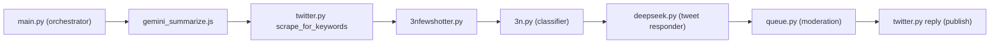

# Implementation Plan – WDF Podcast Social-Engagement Pipeline

This document explains how to build the full, end-to-end pipeline, enumerates **every** code addition/modification required, and lists important architectural & operational considerations.

---

## 0. Cursor Rules in Force

We comply with **all** workspace rules 1 – 13:

* semantic search before edits
* no hard-coding
* rich headers / inline comments
* verbose debug & error logging
* tests / sample runs for verification
* no duplicate files; clean-up obsolete ones
* foreground execution of commands … *(etc.)*

---

## 1. Pipeline Overview



> `main.py` orchestrates seven sequential tasks. Each task remains runnable **stand-alone** for ad-hoc debugging.

```
main.py → gemini_summarize.js → twitter.py → 3nfewshotter.py → 3n.py → deepseek.py → queue.py → twitter.py (publish)
```

*All* scripts are **import-safe** (no side-effects at import time) and expose a snake-case `run(**kwargs)` helper **except** the Node-based `gemini_summarize.js`, which will be invoked from Python via `subprocess`.

---

## 2. File-by-File Specifics

### 2.1 `main.py`  *(currently empty)*

Goal: beautiful, verbose orchestration with rich logging.

```python
#!/usr/bin/env python3
"""Main pipeline orchestrator for WDF tweet-engagement workflow.
Run `python main.py --help` for options.
"""

from pathlib import Path
import logging, argparse, json, subprocess, time, datetime

# local python modules (all expose run helpers)
import twitter, nfewshotter, n_classifier, deepseek, queue

STAGE_LOG = Path("logs/stage_times.json")


def _timeit(label: str, callable_or_cmd):
    """Run callable_or_cmd, time it, and persist timing metadata."""
    t0 = time.perf_counter()
    if callable(callable_or_cmd):
        callable_or_cmd()
    else:  # assume list/tuple –> subprocess
        subprocess.check_call(callable_or_cmd)
    elapsed = time.perf_counter() - t0
    logging.info("✔ %s finished in %.2fs", label, elapsed)
    STAGE_LOG.parent.mkdir(exist_ok=True)
    data = {label: {"seconds": elapsed,
                    "finished": datetime.datetime.utcnow().isoformat()}}
    _append_json(STAGE_LOG, data)


def _append_json(path: Path, obj: dict):
    path.write_text((path.read_text() + "\n" if path.exists() else "") + json.dumps(obj, indent=2))


def run(verbose: bool = False):
    logging.basicConfig(level=logging.DEBUG if verbose else logging.INFO,
                        format="%(asctime)s | %(levelname)s | %(message)s",
                        datefmt="%H:%M:%S")

    logging.info("🚀 Starting WDF end-to-end pipeline")

    _timeit("gemini_summarize", ["node", "gemini_summarize.js", "--verbose"])
    _timeit("twitter_scrape", twitter.scrape_for_keywords)
    _timeit("fewshot_generation", nfewshotter.run)
    _timeit("tweet_classification", n_classifier.run)
    _timeit("deepseek_responses", deepseek.run)
    _timeit("moderation_queue", queue.run)

    logging.info("🎉 Pipeline completed successfully")


def main():
    ap = argparse.ArgumentParser(description="Run full WDF tweet pipeline")
    ap.add_argument("--debug", action="store_true", help="Enable DEBUG logging")
    args = ap.parse_args()
    run(verbose=args.debug)


if __name__ == "__main__":
    main()
```

### 2.2 `gemini_summarize.js`  *(new – replaces `.py`)*

Key points:

* Shells out to **`gemini-cli`** (npm) in the **foreground**.
* Inputs: `transcripts/latest.txt` _and_ `transcripts/podcast_overview.txt`.
* Outputs (only after successful completion):
  * `transcripts/summary.md` — comprehensive markdown summary.
  * `transcripts/keywords.json` — JSON array of relevant keywords.
* Robust retry & error logging; write to `*.tmp` then atomically `rename`.

```js
#!/usr/bin/env node
/**
 * gemini_summarize.js – generate summary & keyword list via gemini-cli.
 */
import { readFileSync, writeFileSync, renameSync } from 'fs';
import { spawnSync } from 'child_process';
import path from 'path';

const latest   = readFileSync('transcripts/latest.txt', 'utf8');
const overview = readFileSync('transcripts/podcast_overview.txt', 'utf8');

const prompt = `You are an expert social-media manager …\n\nTRANSCRIPT:\n${latest}\n\nOVERVIEW:\n${overview}`;

const res = spawnSync('gemini-cli', ['--model', 'gemini-2.5-pro', '--stdin'], { input: prompt, encoding: 'utf8' });

if (res.status !== 0) {
  console.error('gemini-cli failed:', res.stderr);
  process.exit(res.status);
}

const output = res.stdout.trim();
const [summaryPart, keywordPart] = output.split(/### Keywords/i);

writeFileSync('transcripts/summary.md.tmp',       summaryPart.trim());
writeFileSync('transcripts/keywords.json.tmp',    JSON.stringify(keywordPart.match(/\w+/g) || [], null, 2));
renameSync('transcripts/summary.md.tmp',    'transcripts/summary.md');
renameSync('transcripts/keywords.json.tmp', 'transcripts/keywords.json');
console.log('✅  summary.md & keywords.json updated');
```

*(The rest of the pipeline remains unchanged; just update import/command names where relevant.)*

### 2.3 `twitter.py` – Mock Twitter API Layer

Key goals: deterministic tests, zero real network calls, audit trail of publishes.

```python
#!/usr/bin/env python3
"""
twitter.py – Mock Twitter interface used by the pipeline.
"""
import json, logging, random, string
from pathlib import Path
from datetime import datetime

TWEETS_PATH    = Path("transcripts/tweets.json")
PUBLISHED_PATH = Path("transcripts/published.json")
RAND = random.Random(42)  # deterministic for repeatable tests


def _rand_id(k: int = 18) -> str:
    """Return a pseudo-random tweet ID."""
    return "t" + "".join(RAND.choices(string.ascii_lowercase + string.digits, k=k))


def scrape_for_keywords(keywords_path: str = "transcripts/keywords.json",
                        out: Path = TWEETS_PATH,
                        count: int = 100) -> None:
    """Create *count* mock tweets referencing supplied keywords."""
    keywords = json.loads(Path(keywords_path).read_text())
    tweets = []
    for _ in range(count):
        kw = RAND.choice(keywords)
        text = f"Hot take 👉 {kw}! What do y'all think? #WDFpod"
        tweets.append({"id": _rand_id(), "text": text, "user": f"@user{RAND.randint(1,9999)}"})
    out.write_text(json.dumps(tweets, indent=2))
    logging.info("Generated %s mock tweets → %s", len(tweets), out)


def reply(tweet_id: str, text: str) -> None:
    """Mock posting a reply – write to published.json & log to console."""
    entry = {"id": tweet_id, "reply": text, "timestamp": datetime.utcnow().isoformat()} 
    logging.info("[MOCK] Replying to %s: %s", tweet_id, text[:60])
    data = []
    if PUBLISHED_PATH.exists():
        data = json.loads(PUBLISHED_PATH.read_text())
    data.append(entry)
    PUBLISHED_PATH.write_text(json.dumps(data, indent=2))
```

### 2.4 `3nfewshotter.py` – Few-Shot Generator

Generates exactly **20** `(tweet, label)` pairs in JSON for use by `3n.py`.

```python
#!/usr/bin/env python3
"""Generate few-shot examples via Gemma-3n."""
import json, logging, argparse
from pathlib import Path
from ollama import Client

DEFAULT_MODEL = "gemma3n:e4b"
DEFAULT_HOST  = "http://localhost:11434"
OVERVIEW_PATH = Path("transcripts/podcast_overview.txt")
SUMMARY_PATH  = Path("transcripts/summary.md")
OUT_PATH      = Path("transcripts/fewshots.json")


def build_prompt(overview: str, summary: str) -> str:
    return (
        "<start_of_turn>system\n"
        "You will output EXACTLY 20 lines. Each line must contain a tweet text,"
        " a TAB (\\t), then either RELEVANT or SKIP. DO NOT add anything else.\n"
        f"PODCAST OVERVIEW:\n{overview}\nSUMMARY:\n{summary}\n"
        "<end_of_turn>\n<start_of_turn>model\n"
    )


def _generate(client: Client, model: str, prompt: str) -> list:
    resp = client.generate(model=model, prompt=prompt, options={"stop": ["<end_of_turn>"]})
    lines = [l.strip() for l in resp["response"].splitlines() if l.strip()]
    if len(lines) != 20:
        raise ValueError(f"Expected 20 lines, got {len(lines)}")
    pairs = []
    for l in lines:
        if "\t" not in l:
            raise ValueError(f"Missing TAB in line: {l}")
        tweet, label = l.split("\t", 1)
        label = label.strip()
        if label not in ("RELEVANT", "SKIP"):
            raise ValueError(f"Bad label '{label}' in line: {l}")
        pairs.append([tweet.strip(), label])
    return pairs


def run(model: str = DEFAULT_MODEL, host: str = DEFAULT_HOST, out: Path = OUT_PATH) -> None:
    logging.basicConfig(level=logging.INFO, format="%(levelname)s: %(message)s")
    client = Client(host=host)
    examples = _generate(client, model, build_prompt(OVERVIEW_PATH.read_text(), SUMMARY_PATH.read_text()))
    out.write_text(json.dumps(examples, indent=2))
    logging.info("Wrote %d few-shot examples → %s", len(examples), out)


if __name__ == "__main__":
    parser = argparse.ArgumentParser()
    parser.add_argument("--model", default=DEFAULT_MODEL)
    parser.add_argument("--host",  default=DEFAULT_HOST)
    parser.add_argument("--out",   default=str(OUT_PATH))
    args = parser.parse_args()
    run(args.model, args.host, Path(args.out))
```

### 2.5 `few_shot_examples.py` – Dynamic Loader

Replace the static list with a JSON loader so **no** code regen is needed when `fewshots.json` changes.

```python
#!/usr/bin/env python3
"""Utility module that exposes FEW_SHOT_EXAMPLES from transcripts/fewshots.json."""
import json, logging, pathlib

_JSON = pathlib.Path("transcripts/fewshots.json")

try:
    FEW_SHOT_EXAMPLES = json.loads(_JSON.read_text())
except Exception as exc:
    logging.error("Failed to load %s: %s", _JSON, exc)
    FEW_SHOT_EXAMPLES = []  # fallback to empty list so downstream code still imports
```

### 2.6 `3n.py` – Minor Patch

* Add CLI flag `--fewshots-json` *(optional override)*.
* Keep import `from few_shot_examples import FEW_SHOT_EXAMPLES` – it now loads dynamically.

```diff
@@
 parser = argparse.ArgumentParser(...)
+parser.add_argument("--fewshots-json", default="transcripts/fewshots.json",
+                    help="Path to few-shot JSON (default: %(default)s)")
@@
-if args.random:
+# Reload examples if user passed custom JSON
+if args.fewshots_json and args.fewshots_json != "transcripts/fewshots.json":
+    import json
+    examples = json.load(open(args.fewshots_json))
+elif args.random:
     examples = select_balanced_examples(...)
```

(Everything else stays untouched.)

### 2.7 `deepseek.py` – Batch `run()` Wrapper

```python
def run():
    """Generate DeepSeek replies for pending relevant tweets."""
    import json, logging
    from pathlib import Path

    DATA = Path("transcripts/relevant_tweets.json")
    tweets = json.loads(DATA.read_text())
    new = 0
    for row in tweets:
        if row.get("classification") != "RELEVANT" or row.get("response"):
            continue
        reply = generate_reply(row["text"])  # reuse existing helper
        row["response"] = reply
        new += 1
    DATA.write_text(json.dumps(tweets, indent=2))
    logging.info("DeepSeek generated %d new responses", new)
```

### 2.8 `queue.py` – Interactive Moderation TUI

Lightweight terminal interface (no external deps; uses the user's `$EDITOR` for edits):

```python
#!/usr/bin/env python3
"""Moderate generated replies before (mock) publication."""
import json, os, subprocess, argparse
from pathlib import Path
import twitter  # our mock API layer

DATA = Path("transcripts/relevant_tweets.json")


def _edit(text: str) -> str:
    editor = os.getenv("EDITOR", "nano")
    from tempfile import NamedTemporaryFile
    with NamedTemporaryFile("w+", delete=False, suffix=".md") as tf:
        tf.write(text)
        tf.flush()
        subprocess.call([editor, tf.name])
        tf.seek(0)
        return tf.read()


def run():
    rows = json.loads(DATA.read_text())
    for row in rows:
        if row.get("status") in {"approved", "rejected"}:
            continue
        print("\n==== ORIGINAL ====")
        print(row["text"])
        print("---- PROPOSED REPLY ----")
        print(row.get("response", "<none>"))
        choice = input("[a]pprove  [e]dit  [r]eject  [q]uit > ").lower()
        if choice == "q":
            break
        if choice == "e":
            row["response"] = _edit(row.get("response", ""))
            row["status"] = "edited"
        elif choice == "a":
            row["status"] = "approved"
            twitter.reply(row["id"], row["response"])
        elif choice == "r":
            row["status"] = "rejected"
    DATA.write_text(json.dumps(rows, indent=2))


if __name__ == "__main__":
    run()
```

---

## 3. Data Contracts

| file | schema |
|------|--------|
| `transcripts/summary.md` | markdown with `### Keywords` section |
| `transcripts/keywords.json` | `string[]`